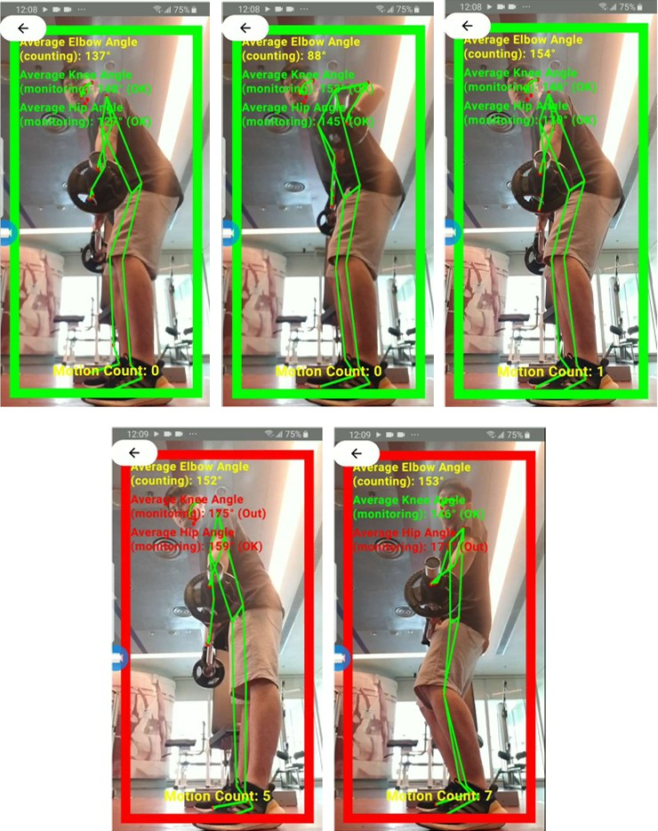

# Real-Time Posture Monitoring App for Weight Training

## Overview
This Android application leverages real-time pose estimation to monitor and provide feedback on posture accuracy during weight training exercises. By utilizing the front camera of a mobile device, the app aims to enhance training effectiveness and reduce injury risks caused by improper posture. The app employs the BlazePose Full model for pose estimation and trigonometrically computed joint angles for posture classification.

## Features
- **Real-Time Pose Estimation**: Uses the BlazePose Full model to detect and track human joints from video frames captured by the phone's front camera.
- **Posture Feedback**: Provides real-time feedback on posture correctness and repetition counting by analyzing joint coordinates and computing joint angles.
- **Lightweight and Optimized**: Designed for mobile devices, ensuring efficient performance with minimal computational overhead.
- **User-Friendly Interface**: Simple and intuitive interface for users to monitor their posture during weight training sessions.
- **Exercise Coverage**: Supports 9 weight training exercises (Straight Arm Pulldown, High Cable Curls, Cable Triceps Pulldown, Front Squat, Barbell Row, Incline Chest Press, Dumbbell Shoulder Press, Sit-up, Push-up).

## DEMO Video
https://youtu.be/85GzO6_0YBg?si=pBjMOE9sKEd2fHcg

## DEMO Images

<div style="display: flex; justify-content: space-between; align-items: flex-start; flex-wrap: nowrap; width: 100%; gap: 20px;">
  <div style="text-align: center; flex: 1; margin: 0 50px;">
    <p style="font-weight: bold;">Straight Arm Pulldown</p>
    
  </div>
  <div style="text-align: center; flex: 1; margin: 0 50px;">
    <p style="font-weight: bold;">High Cable Curls</p>
    
  </div>
  <div style="text-align: center; flex: 1; margin: 0 50px;">
    <p style="font-weight: bold;">Barbell Row</p>
    
  </div>
</div>

## Project Structure
- **app/src/main/java**: Contains the core Java/Kotlin code for the Android app, including camera integration, pose estimation, and posture classification logic.
- **app/src/main/res**: Includes resources such as layouts, drawables, and the TensorFlow Lite model file for BlazePose.
- **app/src/main/assets**: Stores the informative contents related to different weight training workouts.
- **FinalReport_DeepLearningBasedPostureMonitoringApp.pdf**: Documentation, including model evaluation results and project reports.

## Installation
1. **Clone the Repository**:
   ```bash
   git clone https://github.com/DGOliver-backup/CityU_FYP_PostureMonitoringApp.git
   ```
2. **Open in Android Studio**:
   - Launch Android Studio and select `Open an existing project`.
   - Navigate to the cloned repository folder and select it.
3. **Run**:
   - Connect an Android device or use an emulator.
   - Run the app from Android Studio.

## Usage
1. Launch the app on your Android device.
2. Grant camera permissions when prompted.
3. Position the device to capture your full body using the front camera.
4. Perform weight training exercises, and the app will provide real-time feedback on posture accuracy.
5. Review feedback displayed on the screen to adjust your posture as needed.

## Technical Details
### Stage 1: Pose Estimation
- **Model Selection**: Evaluated MoveNet, BlazePose, and YOLO11n-pose for computational efficiency and joint prediction accuracy.
- **Chosen Model**: BlazePose Full, selected for its superior balance of accuracy and performance on mobile devices.
- **Implementation**: Integrates TensorFlow Lite for running the BlazePose model on Android, extracting joint coordinates from camera frames.

### Stage 2: Posture Classification
- **Methodology**: Uses trigonometrically computed joint angles for posture analysis.
- **Algorithm Selection**: Compared KNN, Random Forest, and Logistic Regression; trigonometric angle computation was chosen for its accuracy and scalability.
- **Feedback Mechanism**: Real-time posture correctness is determined by comparing computed angles against predefined thresholds for each exercise.

## Evaluation
- **Pose Estimation**:
  - Metrics: Computational intensiveness (FPS), joint prediction accuracy (MSE).
  - Results: BlazePose Full outperformed MoveNet and YOLO11n-pose in both metrics.
- **Posture Classification**:
  - Metrics: Classification accuracy, scalability.
  - Results: Trigonometric joint angle approach achieved satisfactory accuracy with lower computational overhead compared to ML-based methods.

## Potential Future Work
- **Exercise Library Expansion**: Add support for a wider range of weight training exercises.
- **Enhanced Feedback**: Incorporate visual and auditory cues for more intuitive posture correction.
- **Cross-Platform Support**: Extend the app to iOS using compatible pose estimation frameworks.
- **Model Optimization**: Further optimize the BlazePose model for lower-end devices.

## License
This project is licensed under the MIT License. See the [LICENSE](LICENSE) file for details.

## Acknowledgments
- TensorFlow Lite for providing the MoveNet model.
- Google ML Kit for providing the BlazePose models.
- Ultray for providing the YYOLO11n-pose model.
- Android Studio for the development environment.
- Research papers and open-source communities for insights on pose estimation and posture classification.
